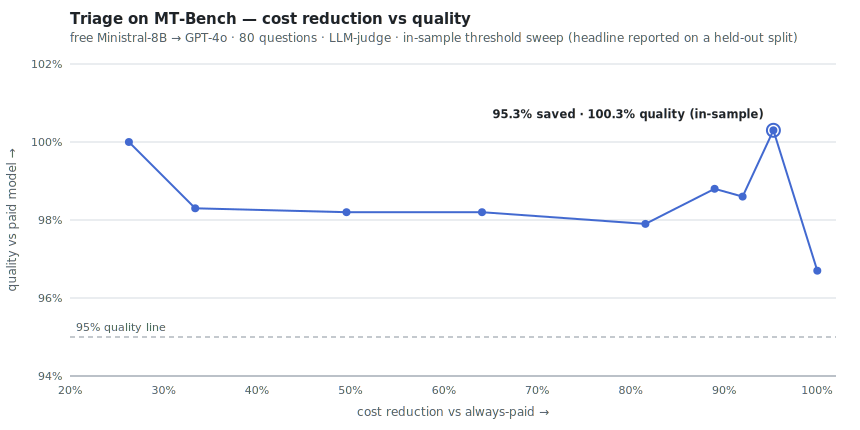

<p align="center">
  
</p>

<h1 align="center">Triage</h1>
<p align="center"><b>Right model, every request.</b><br>
Free open-source models answer first. Your paid model is called only when
the answer's own signals prove it's needed. Unanswerable requests are refused,
not hallucinated.</p>

---

<picture>
  <source media="(prefers-color-scheme: dark)" srcset="docs/assets/mtbench_curve_dark.svg">
  
</picture>

**Measured, not estimated** — real API bills, raw per-query receipts in `data/`.
Headline MT-Bench numbers are reported on a **held-out test split** (threshold
chosen on a tuning half, reported on the untouched half — never tuned on test),
with bootstrap 95% CIs:

| Result | Number | Where |
|---|---|---|
| MT-Bench, free Nemotron-Nano-9B → GPT-4o **(held-out, 5 seeds)** | **81.6% saved** (range 75.7–87.9%) at **103.1%** of GPT-4o quality (range 101.2–105.9%), 4–9/40 escalated | `data/mtbench_nemotron_holdout_multiseed.json` |
| MT-Bench, free Ministral-8B → GPT-4o **(held-out, 5 seeds)** | **96.0% saved** (range 92–100%) at **98.4%** of GPT-4o quality (range 96.0–100.3%), 0–3/40 escalated | `data/mtbench_gpt4o_holdout_multiseed.json` |
| GSM8K, gpt-4o-mini → GPT-4o **(5 seeds, CIs, significance)** | **85.1% saved** (CI 81.4–88.9%) at **≥ big-model accuracy** (triage 0.960 vs big 0.900, +0.06, *p*=0.017) | `data/rigor_gsm8k_multiseed.json` |
| 30-query mixed live bill | **69.5% saved** ($0.0637 → $0.0195), 24/30 answers cost $0 | `data/showtime.json` |

**Negative results (published on purpose — see `CHARTER.md`):**

| Negative | What happened | Where |
|---|---|---|
| GSM8K over-escalation | router escalated 57.8% and **fell to 51.1%** accuracy (56.1% of GPT-style big quality) while both baselines held ~91–93% | `data/rigor_gsm8k.json` |
| GSM8K after the fix | accuracy recovered to the small model's 86.7%, but on that sample it **cost 29.1% MORE** than always-big | `data/rigor_gsm8k_fixed.json` |

> The old README claimed "95.3% saved at 100.3% quality" for the Ministral pair.
> That point was chosen by sweeping the threshold on the same 80 questions it was
> reported on. On a held-out split it does **not** survive: escalation is so rare
> on MT-Bench that the result is really "the free small model alone retains ~99%
> of GPT-4o quality," with a wide CI. The Nemotron pair, which escalates more,
> holds up. See the note in `scripts/mtbench_holdout.py`.

---

## Quick start

```bash
git clone https://github.com/ishaannk/triage.git && cd triage
cp .env.example .env        # add the keys you have
./run.sh                    # venv + deps + server on :8000
```

Open **http://localhost:8000**. A one-time setup asks two questions:

1. **Small tasks** → pick a free open-source model (default: Llama 3.1 8B on NVIDIA NIM)
2. **Hard tasks** → pick your paid model (e.g. GPT-4o) and paste your API key
   — the key lives in your browser only, attached per request, never stored server-side

Every answer shows which model ran, why, the tokens, the exact cost, and your
running savings. A **Live demo** page (`/ui/demo.html`) tells the cost story
with the measured numbers.

**Keys** (any subset; missing providers fall back to an offline mock):

| Provider | `.env` line | Role |
|---|---|---|
| NVIDIA NIM — [free key](https://build.nvidia.com) | `nvidia=nvapi-…` | the **free lane**: Llama, Nemotron, Gemma, Phi (with logprobs) |
| OpenAI | `OPENAI_API_KEY=sk-…` | the **paid lane**: gpt-4o-mini / gpt-4o / gpt-5-mini / gpt-5 |

---

## How it works

```
request ─► calculator tool ── exact arithmetic → exact answer, $0, no LLM
        └► FREE small model ── one pass + free logprob uncertainty
              │ confident → ship it            (measured 42–95% of requests, $0)
              │ suspicious → deeper signals: resample agreement · self-check · evidence
              │ risky → retrieve → verify (can revise) → escalate to YOUR paid model
              └ unanswerable → PENDING_REVIEW  (refuse, never confabulate)
```

The **primary** decision is made **after observing the free model's actual
answer** — not guessed from the prompt. No offline preference-model training and
no per-pair calibration: pick any two models in the UI and it works.

Three **optional, training-free** add-ons sit around that core (all toggleable in
`config/router.yaml`; the observe-then-allocate loop is always the safety net):

- a **predict-then-route pre-filter** that can short-circuit obviously easy/hard
  prompts *before* generation (a hybrid front-end — so routing is not purely
  post-observation when it is enabled);
- a **semantic memory** intended to skip probes on known-safe prompt clusters;
- an **online controller** that nudges the escalation threshold from live
  outcomes — a light, label-free adaptation (not preference-data training, but it
  *is* state that changes over time).

Honesty note (see `CHARTER.md` and `data/ablation.json`): a small on/off ablation
found these three add-ons **accuracy-neutral and roughly cost-neutral** on a cold,
10-prompt set — their intended savings (memory skipping probes) need a larger
workload with repeated prompts to show up and are **not yet demonstrated at
scale**. Treat them as hypotheses, not proven wins. `/anomalies` flags cost
spikes; every decision is logged to SQLite with its full signal vector, now
including a compute-cost estimate and the routing overhead.

---

## Benchmarks — reproduce everything

```bash
PYTHONPATH=. python scripts/mtbench.py llama-3.1-8b gpt-4o          # cost-quality curve (held-out headline)
PYTHONPATH=. python scripts/mtbench_holdout.py --multiseed data/mtbench_nemotron.json  # held-out over 5 seeds, $0
PYTHONPATH=. python scripts/showtime.py                             # 30-query live bill
PYTHONPATH=. python scripts/rigor_multiseed.py --dataset gsm8k --n 30 --seeds 5  # 5 seeds + CIs + significance
PYTHONPATH=. python scripts/ablation.py                             # prefilter/memory/online on-off ablation
```

Run the tests (no keys, no network — all on the mock provider):

```bash
pip install -r requirements-dev.txt
PYTHONPATH=. pytest -q      # abstain invariant, tier routes, verify parser, scoring, honest-metric guard
```

The MT-Bench script makes **one paid pass per question**, then sweeps the
escalation threshold offline — the whole curve costs one run. It splits the
questions 50/50, picks the threshold on the **tuning** half, and reports the
headline on the untouched **test** half (`scripts/mtbench_holdout.py`
regenerates that split from committed receipts, no new spend). The rigor harness
adds bootstrap confidence intervals and an unanswerable-traps set for the
abstain axis.

*Fine print (all truth):* the curve above is a single in-sample run; the judge is
gpt-4o-mini scoring 1–10; first turns only; free-lane models run on provider free
tiers. MT-Bench is partly saturated for modern small models — at "never escalate"
the free model alone held 96.7% of GPT-4o quality — so escalation is rare and the
held-out CIs are wide (few escalations per test half). The verify cost guard uses
a **configured** per-pass overhead (`verify.overhead_tokens`), calibratable from
telemetry via `python -m app.benchmark.verify_overhead`; it is a default, not a
per-request measurement. Raw per-question scores are all in the JSON to check.

---

## API

| Method | Path | Purpose |
|---|---|---|
| `GET` | `/` | Chat UI (setup wizard on first visit) |
| `GET` | `/ui/demo.html` | Live demo — the measured cost story |
| `POST` | `/chat` | Route + answer one message |
| `GET` | `/models` | Model catalog + live provider status |
| `GET` | `/health` | Providers, retrieval backend, mock flag |
| `GET` | `/telemetry?limit=N` | Per-request tier/signals/cost log |
| `GET` | `/anomalies` | Cost-anomaly detection |
| `POST` | `/ingest` | Add documents to the retrieval store |
| `POST` | `/benchmark` | 3-config eval harness |

```bash
curl -s localhost:8000/chat -H 'content-type: application/json' -d '{
  "message": "Prove sqrt 2 is irrational",
  "model": "llama-3.1-8b",
  "escalate_to": "gpt-4o",
  "api_key": "sk-optional-byo-key"
}'
```

---

## Make it yours (modular by design)

- **Add a model** — one YAML block in [`config/models.yaml`](config/models.yaml):
  set `provider`, `provider_model`, `role: small` (everyday picker) or
  `role: big` (hard-task picker). Done — it appears in the UI.
- **Add a provider** — subclass the adapter in `app/providers/` (anything
  OpenAI-compatible is ~10 lines) and register it in `registry.py`.
- **Retune routing** — every threshold lives in
  [`config/router.yaml`](config/router.yaml): signal gate, escalation risk,
  verify caps, pre-filter cuts, online-learning bounds, tools. No code edits.
- **Swap retrieval** — local numpy store by default; set
  `RETRIEVAL_BACKEND=pgvector` + `docker compose up -d` for Postgres.

```
app/
  main.py             FastAPI endpoints
  router/             tiers · abstain · prefilter · memory · online learning
  signals/proxy.py    black-box reliability signals
  tools/calculator.py exact math, $0
  providers/          openai_compat · mock · registry (add yours here)
  verify/             grounding pass (can revise answers)
  telemetry/          SQLite log + anomaly detection
  benchmark/          harness + rigor (GSM8K/MMLU/traps, CIs)
scripts/              mtbench.py · showtime.py · make_curve_svg.py
config/               models.yaml · router.yaml
ui/                   index.html (chat + wizard) · demo.html (cost story)
```

## Deploy

`uvicorn app.main:app` runs on any Python host (Render, Railway, Fly.io, a VPS).
Vercel/Netlify are static-only — they can serve the UI, not the router. Set
provider keys as env vars on the host; visitors bring their own OpenAI key
through the UI.

## Principles

- **Black-box only** : logprobs + resampling; no weights, no attention hooks.
- **Mock-first** : runs end-to-end with zero keys.
- **All truth** : published numbers are measured bills with raw receipts
  committed; headlines are reported on a held-out split, never tuned on test;
  negative results get reported, not buried (see the GSM8K rows above and the two
  `data/rigor_gsm8k*.json` files).
- **Scope is chartered** : Triage is a deliberate text-only, API-cost pivot of a
  broader plan; what is in and out of scope is written down in
  [`CHARTER.md`](CHARTER.md).
